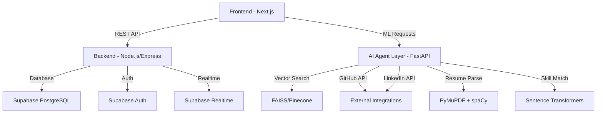

# OpenHR Platform

**Open-Source AI-Powered Co-Founder & Developer Talent Matching Platform**

OpenHR is a production-ready, AI-powered talent matching platform designed specifically for co-founders and developers seeking startup opportunities. Built with modern web technologies and advanced AI/ML algorithms, OpenHR solves the critical problem of finding compatible startup team members through semantic skill matching, personality compatibility assessment, and intelligent profile enrichment.

[](https://opensource.org/licenses/MIT)
[](#)

---

## 🎯 Mission

Build an open-source talent-matching platform that connects:
- **Co-founders** seeking technical partners with complementary skills and aligned vision
- **Developers** looking for startup opportunities with early-stage companies
- **Startups** seeking founding team members with specific technical and domain expertise

---

## 🚀 Core Features

### 1. AI-Powered Skill Matching Engine
- Semantic skill matching using vector embeddings (sentence transformers)
- Complementary skill gap analysis
- Tech stack alignment scoring
- Multi-factor compatibility (skills, personality, timezone, equity preferences)

### 2. Co-Founder Discovery System
- Vision and mission alignment scoring
- Equity split recommendation engine
- Team chemistry prediction models
- Introduction request workflows

### 3. Profile Enrichment AI
- Auto-extract skills from GitHub repos and contributions
- Resume parsing with NLP (spaCy, PyMuPDF)
- LinkedIn integration for experience mapping
- Skill taxonomy normalization

### 4. Real-Time Messaging & Collaboration
- In-app chat with Supabase Realtime
- Video call scheduling integration
- Context-aware message suggestions
- Collaborative document sharing

### 5. Reputation & Trust System
- Portfolio verification (GitHub, LinkedIn)
- Skill endorsements from collaborators
- Anti-spam and fake profile detection
- Project success tracking

### 6. Developer Opportunity Matching
- Startup stage filtering (idea, MVP, seed, Series A)
- Role type matching (founding engineer, CTO, technical co-founder)
- Compensation model preferences (equity-heavy, salary-focused, hybrid)
- Remote vs. in-person and timezone preferences

---

## 👥 Target Users

### Technical Co-Founders
Seeking business/product co-founders with complementary skills, shared vision, and startup experience.

### Business Co-Founders
Looking for technical co-founders to build their MVP and scale their product.

### Founding Engineers
Developers seeking equity-heavy opportunities at early-stage startups (pre-seed to Series A).

### Early-Stage Startups
Startups needing founding team members with specific technical expertise and cultural fit.

---

## 🏗️ Architecture Overview

### Tech Stack

**Frontend:**
- React 18+ with TypeScript
- Next.js 14+ (App Router)
- TailwindCSS + Radix UI
- React Query for state management

**Backend:**
- Node.js + Express.js (REST API)
- Supabase (PostgreSQL, Auth, Realtime, Storage)
- FastAPI (Python) for ML pipelines

**AI/ML Layer:**
- Sentence Transformers (all-mpnet-base-v2)
- spaCy for NER and text processing
- LangChain/LangGraph for AI agents
- OpenAI GPT-4 / Anthropic Claude for LLM tasks

**Infrastructure:**
- Vercel (frontend hosting)
- Supabase Cloud (backend + database)
- Railway/Fly.io (Python ML services)

### System Components



**For detailed architecture**, see:
- [System Architecture](docs/architecture/system-architecture.md)
- [Database Schema](docs/architecture/database-schema.md)
- [AI Agent Design](docs/architecture/ai-agent-design.md)
- [API Specification](docs/architecture/api-specification.md)

---

## 📁 Repository Structure

```
openhr-platform/
├── README.md                          # You are here
├── LICENSE                            # MIT License
├── .gitignore                         # Node/React ignores
├── llm.txt                            # System prompt for AI agents
│
├── docs/
│   ├── research/                      # Market & user research (Days 1-2)
│   │   ├── competitive-analysis.md    # Y Combinator, Wellfound, CoFoundersLab
│   │   ├── user-personas.md           # 4 target user personas
│   │   ├── pain-point-mapping.md      # Critical user pain points
│   │   ├── cofounder-frameworks.md    # Team formation research
│   │   ├── skill-matching-algorithms.md   # Semantic matching approaches
│   │   ├── skill-taxonomy.md          # Skill normalization strategies
│   │   ├── recommendation-engine.md   # Collaborative vs content-based filtering
│   │   └── llm-use-cases.md           # LLM integration patterns
│   │
│   ├── architecture/                  # System design (Day 3)
│   │   ├── system-architecture.md     # High-level system design
│   │   ├── database-schema.md         # PostgreSQL schema + ERD
│   │   ├── ai-agent-design.md         # Agent workflows and tools
│   │   ├── api-specification.md       # REST API endpoints
│   │   └── tech-stack-justification.md    # Technology choices
│   │
│   ├── platform/                      # Feature implementations (Day 4)
│   │   ├── profile-enrichment-pipeline.md  # GitHub/resume parsing
│   │   ├── github-integration.md      # OAuth2 + skill extraction
│   │   ├── resume-parsing.md          # PDF parsing with spaCy NER
│   │   ├── realtime-messaging.md      # Supabase Realtime architecture
│   │   └── skill-normalization.md     # Taxonomy mapping
│   │
│   ├── open-source/                   # Community & monetization (Day 6)
│   │   ├── community-guidelines.md    # Contribution workflows
│   │   └── monetization-strategy.md   # Freemium + white-label
│   │
│   ├── strategy/                      # Growth & partnerships (Day 7)
│   │   ├── seo-content-marketing.md   # SEO keywords and content plan
│   │   ├── growth-viral-loops.md      # Referral programs
│   │   ├── partnership-opportunities.md   # Accelerators, communities
│   │   └── metrics-success-criteria.md    # KPIs and analytics
│   │
│   └── deliverables/                  # Executive summaries (Day 7)
│       ├── executive-summary.md       # High-level overview
│       └── technical-roadmap.md       # Phase-based implementation plan
│
├── specifications/                    # UI/UX & feature specs (Day 5)
│   ├── onboarding-flow.md            # Progressive profile completion
│   ├── match-discovery-ui.md         # Swipe/grid interface design
│   ├── messaging-ux.md               # Chat interface specifications
│   └── mvp-feature-specs.md          # Core MVP features + acceptance criteria
│
├── ui-design/                         # Visual design (Day 5)
│   └── wireframes.md                 # Low-fidelity wireframes (Mermaid)
│
├── datasets/                          # Open datasets for training
│   └── open-datasets.md              # Curated dataset list with licenses
│
└── agents/                            # AI agent implementations (future)
    ├── profile-enrichment-agent/
    ├── match-scoring-agent/
    ├── recommendation-agent/
    └── message-suggestion-agent/
```

---

## 🧑‍💻 Start Here for Developers

### For Contributors & Coding Agents

This repository is currently in the **Research & Planning phase**. All implementation specifications are complete and ready for coding agents to begin building.

**Essential Reading (in order):**

1. **[System Architecture](docs/architecture/system-architecture.md)** – Understand the overall system design
2. **[Database Schema](docs/architecture/database-schema.md)** – Review the PostgreSQL data model
3. **[AI Agent Design](docs/architecture/ai-agent-design.md)** – Learn the AI agent workflows
4. **[API Specification](docs/architecture/api-specification.md)** – REST API endpoints and contracts
5. **[Tech Stack Justification](docs/architecture/tech-stack-justification.md)** – Why React, Node.js, Supabase, etc.
6. **[MVP Feature Specs](specifications/mvp-feature-specs.md)** – Core features to build first
7. **[Skill Matching Algorithms](docs/research/skill-matching-algorithms.md)** – Semantic matching implementation

### For Researchers & Product Teams

**Market & User Research:**
- [Competitive Analysis](docs/research/competitive-analysis.md) – Y Combinator, Wellfound, CoFoundersLab
- [User Personas](docs/research/user-personas.md) – 4 detailed target personas
- [Pain Point Mapping](docs/research/pain-point-mapping.md) – Critical user challenges

**AI/ML Strategy:**
- [LLM Use Cases](docs/research/llm-use-cases.md) – Profile summarization, match explanations
- [Recommendation Engine](docs/research/recommendation-engine.md) – Collaborative vs content-based filtering
- [Skill Taxonomy](docs/research/skill-taxonomy.md) – Normalization strategies

---

## 🛠️ Installation & Setup

> **Note:** Implementation has not started yet. This section will be populated once coding begins.

**Planned Setup Steps:**

```bash
# Clone the repository
git clone https://github.com/ArjunFrancis/openhr-platform.git
cd openhr-platform

# Install frontend dependencies
cd frontend
npm install

# Install backend dependencies
cd ../backend
npm install

# Install ML service dependencies
cd ../ml-service
pip install -r requirements.txt

# Set up environment variables
cp .env.example .env
# Edit .env with your Supabase, OpenAI, GitHub API keys

# Run development servers
npm run dev        # Frontend on localhost:3000
npm run server     # Backend on localhost:4000
python main.py     # ML service on localhost:8000
```

---

## 🤝 Contributing

> **Current Phase:** Research & Planning (Documentation Only)  
> **Contributions Welcome:** Documentation improvements, research validation, architecture feedback

We welcome contributions from the community! Since we're in the research phase, the best ways to contribute right now are:

1. **Review Documentation** – Provide feedback on specs and architecture
2. **Research Validation** – Verify our competitive analysis and user personas
3. **Dataset Curation** – Suggest open datasets for skill matching and resume parsing
4. **Community Building** – Share OpenHR with startup communities and developer networks

**Once implementation begins:**
- Follow the [Community Guidelines](docs/open-source/community-guidelines.md) (coming soon)
- Check GitHub Issues for "good first issue" labels
- Submit PRs with clear descriptions and tests

---

## 📊 Project Status

### 7-Day Research Plan Progress

- ✅ **Day 1:** Market Intelligence & User Persona Research (COMPLETE)
- ✅ **Day 2:** Skill Matching Algorithms & AI/ML Strategy (COMPLETE)
- ✅ **Day 3:** System Architecture & Database Design (COMPLETE)
- ✅ **Day 4:** Profile Enrichment & Real-Time Messaging (COMPLETE)
- 🔄 **Day 5:** UI/UX Design & Feature Specifications (IN PROGRESS)
- ⏳ **Day 6:** Trust, Privacy & Open-Source Strategy (PENDING)
- ⏳ **Day 7:** Growth Strategy & Final Assembly (PENDING)

**Overall Completion:** ~60% (15/25 deliverables complete)

---

## 📜 License

This project is licensed under the **MIT License** – see the [LICENSE](LICENSE) file for details.

**Open-Source Forever.** OpenHR will always remain free and open-source for individual developers and co-founders. Commercial white-label licensing and enterprise support may be offered in the future.

---

## 🌟 Vision

We believe every founder deserves to find their ideal co-founder, and every developer deserves to find their dream startup. OpenHR aims to be the **open-source standard** for talent matching in the startup ecosystem.

**Our Goals:**
- 🎯 **10,000+ successful co-founder matches** in Year 1
- 🌍 **100,000+ developers and founders** on the platform by Year 2
- 🤝 **Partner with top accelerators** (Y Combinator, Techstars, 500 Startups)
- 🏆 **Become the #1 open-source HR platform** for startups

---

## 📞 Contact & Community

- **GitHub Issues:** [Report bugs or request features](https://github.com/ArjunFrancis/openhr-platform/issues)
- **Discussions:** [Join community discussions](https://github.com/ArjunFrancis/openhr-platform/discussions)
- **Project Owner:** [@ArjunFrancis](https://github.com/ArjunFrancis)

---

## 🙏 Acknowledgments

Inspired by the open-source community and the challenges faced by founders worldwide. Special thanks to:
- Y Combinator Co-Founder Matching research
- Wellfound (AngelList) for talent matching insights
- Sentence Transformers team for semantic search models
- Supabase for the incredible open-source backend platform

---

**Built with ❤️ by the OpenHR Community**
