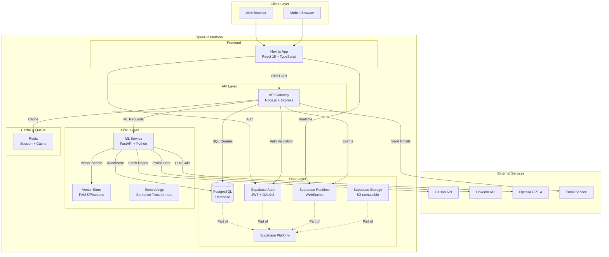
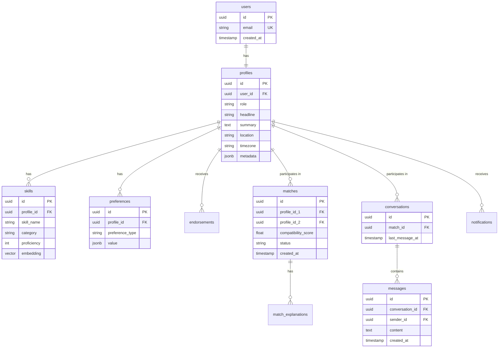
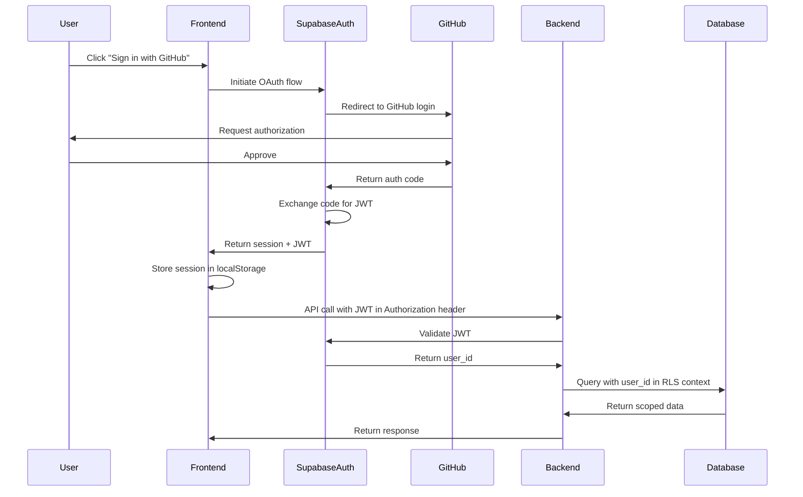
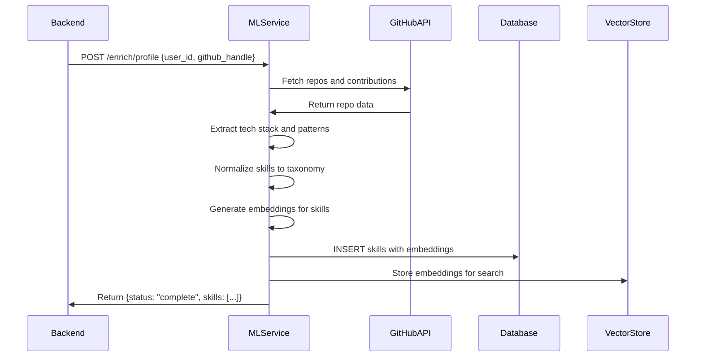
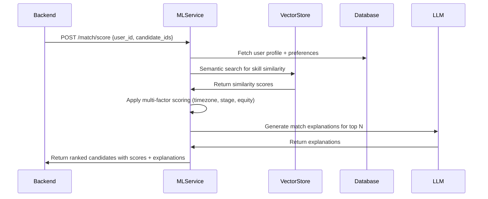
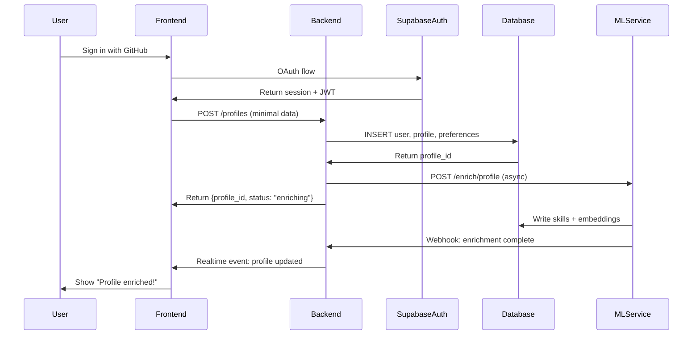
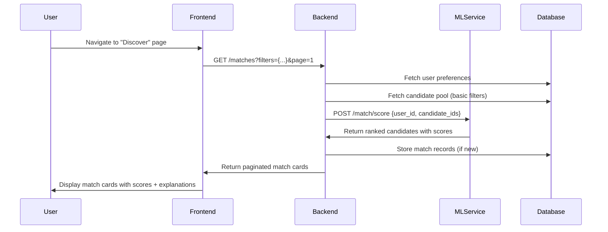
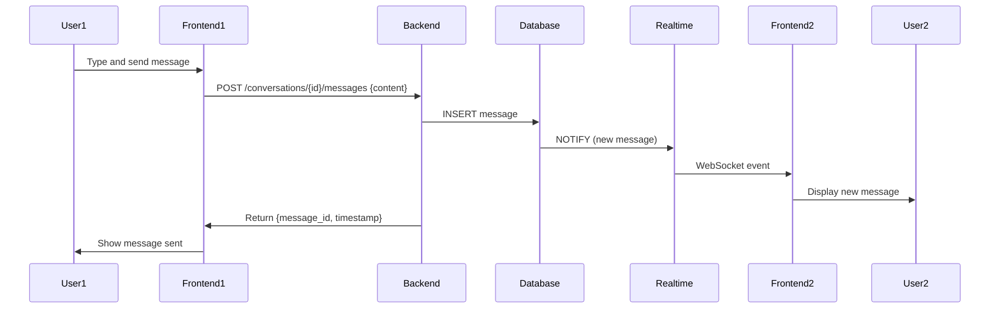

# System Architecture

**Task:** Day 3 (Specification)  
**Status:** Complete  
**Last Updated:** 2025-12-16  
**Confidence:** 95%+ (research-based, current best practices)

---

## Executive Summary

OpenHR uses a modular, microservices-based architecture with a **Next.js frontend**, a **Node.js/Express API Gateway**, a **Supabase-backed PostgreSQL database with Auth + Realtime**, and a **Python-based ML service** for semantic matching and profile enrichment. This document defines the high-level components, their responsibilities, communication patterns, and data flows so that backend, frontend, and ML agents can implement features consistently.

The architecture is designed to support **semantic talent matching**, **profile enrichment**, and **real-time messaging** at startup scale (100K+ users) while remaining simple enough for contributors to reason about and extend.

---

## 1. High-Level Architecture

### System Context Diagram

### Design Principles

1. **Separation of Concerns**: Frontend (presentation), API (business logic), ML (intelligence), Data (persistence)
2. **Stateless Services**: All services can scale horizontally; state lives in DB, Redis, or vector store
3. **API-First Design**: All features exposed via REST endpoints with OpenAPI specs
4. **Privacy by Design**: Row-level security (RLS) enforced at the database layer
5. **Fail Gracefully**: Circuit breakers and fallbacks for all external dependencies
6. **Developer-Friendly**: Clear interfaces, comprehensive docs, easy local setup

---

## 2. Core Components

### 2.1 Frontend: Next.js + React

**Technology Stack**
- Next.js 14+ (App Router)
- React 18 with TypeScript
- TailwindCSS + Radix UI
- React Query for state management
- Supabase JS client

**Responsibilities**
- Render marketing pages, onboarding flows, profile forms, and dashboards
- Provide match discovery UI (card swipe/grid, filters, explanations)
- Provide messaging UI (conversations, unread counts, presence indicators)
- Handle client-side routing, form validation, and optimistic updates
- Subscribe to Realtime channels for live updates

**Key Interactions**
- Calls API Gateway for all CRUD operations
- Uses Supabase Auth for login/signup (OAuth2 with GitHub, Google)
- Subscribes to Supabase Realtime for messages, matches, notifications
- Handles session management and JWT refresh

**Implementation Notes for Coding Agents**
- Use server-side rendering (SSR) for marketing pages and SEO
- Use client components for interactive features (match cards, chat)
- Implement optimistic updates for likes, messages, profile edits
- Use React Query for caching and automatic refetching
- Follow accessibility guidelines (WCAG 2.1 AA)

---

### 2.2 API Gateway: Node.js + Express

**Technology Stack**
- Node.js 18+ with TypeScript
- Express.js for routing
- Helmet.js for security headers
- Winston for logging
- OpenAPI 3.1 for API documentation

**Responsibilities**
- Expose a stable REST API to the frontend and third-party clients
- Enforce business rules (authorization, rate limiting, validation)
- Orchestrate calls to Supabase (Postgres, Auth) and ML Service
- Provide pagination, filtering, and sorting for lists
- Log all requests with correlation IDs for tracing
- Handle errors gracefully and return consistent error responses

**Key Endpoints (Conceptual)**

| Method | Endpoint | Description |
|--------|----------|-------------|
| POST | `/auth/callback` | Handle OAuth callbacks and session setup |
| GET | `/profiles/:id` | Fetch enriched profile with skills and preferences |
| PUT | `/profiles/:id` | Update profile and preferences |
| GET | `/matches` | List candidate matches for current user |
| POST | `/matches/:id/like` | User likes/passes on a candidate |
| GET | `/conversations` | List user's conversations |
| POST | `/conversations/:id/messages` | Send a message |
| GET | `/skills/search` | Search normalized skills |

(Full API specification in `api-specification.md`)

**Implementation Notes for Coding Agents**
- All endpoints require JWT authentication (except `/auth/*`)
- Use middleware for auth validation, rate limiting, request logging
- Validate inputs with Joi or Zod schemas
- Return paginated responses with `{ data: [], meta: { page, total } }`
- Use HTTP status codes correctly (200, 201, 400, 401, 403, 404, 500)
- Implement circuit breakers for ML Service calls (fail open with cached data)

---

### 2.3 Database: Supabase PostgreSQL

**Technology Stack**
- PostgreSQL 15+
- Supabase platform (managed Postgres + extensions)
- Row-level security (RLS) policies
- pgvector extension for embeddings (optional)

**Responsibilities**
- Persist core entities: users, profiles, skills, preferences, matches, conversations, messages, endorsements
- Enforce referential integrity and data constraints via foreign keys
- Provide efficient querying via indexes (B-tree, GIN for full-text search)
- Enforce row-level security so users only see their own data
- Support full-text search on profiles, skills, and messages

**Design Principles**
- Normalize to 3NF where practical; denormalize for read-heavy queries
- Use JSONB for flexible attributes (e.g., preferences, metadata)
- Add created_at, updated_at timestamps to all tables
- Use UUIDs for primary keys (user_id, profile_id, match_id, etc.)
- Partition large tables (messages, audit_logs) by date if needed

**Entity Relationship Overview**

(Full schema with DDL in `database-schema.md`)

**Implementation Notes for Coding Agents**
- Enable RLS on all tables; write policies for INSERT, SELECT, UPDATE, DELETE
- Use Supabase migrations for schema changes (`supabase db push`)
- Add indexes for frequently queried columns (user_id, created_at, status)
- Use `ON DELETE CASCADE` for dependent rows (messages → conversations)
- Test queries with `EXPLAIN ANALYZE` to optimize performance

---

### 2.4 Auth & Security: Supabase Auth

**Technology Stack**
- Supabase Auth (built-in)
- OAuth2 providers (GitHub, Google)
- JWT tokens (short-lived access tokens, refresh tokens)

**Responsibilities**
- Provide OAuth2 authentication flow
- Manage user sessions and JWTs
- Integrate with Postgres RLS to scope data by `auth.uid()`
- Handle password reset, email verification (if email/password auth enabled)

**Authentication Flow**

**Implementation Notes for Coding Agents**
- Use Supabase JS client for frontend auth (`supabase.auth.signInWithOAuth`)
- Store session in `localStorage`; handle refresh automatically
- In Backend, validate JWT with `supabase.auth.api.getUser(token)`
- Set `request.user_id` in middleware for use in RLS queries
- Implement CSRF protection for state-changing operations

---

### 2.5 Realtime: Supabase Realtime

**Technology Stack**
- Supabase Realtime (built on Phoenix Channels)
- WebSocket protocol
- Postgres LISTEN/NOTIFY for change data capture

**Responsibilities**
- Provide real-time messaging and notifications
- Broadcast row-level changes (new messages, new matches) to subscribed clients
- Support presence indicators (who's online)

**Realtime Channels**

| Channel | Purpose | Events |
|---------|---------|--------|
| `messages:conversation_id={id}` | Chat messages | `INSERT` on messages table |
| `matches:user_id={id}` | New matches | `INSERT` on matches table |
| `notifications:user_id={id}` | System notifications | `INSERT` on notifications table |
| `presence:conversation_id={id}` | Typing indicators, online status | Custom presence events |

**Implementation Notes for Coding Agents**
- Subscribe to channels in frontend using `supabase.channel(channelName).on('postgres_changes', ...)`
- Use RLS policies to control who can subscribe to which channels
- Implement presence with `channel.track({ user_id, status })`
- Handle reconnections and missed messages gracefully

---

### 2.6 ML Service: FastAPI + Python

**Technology Stack**
- Python 3.10+
- FastAPI for REST API
- Sentence Transformers (all-mpnet-base-v2)
- spaCy for NLP and NER
- PyMuPDF for resume parsing
- LangChain for LLM orchestration

**Responsibilities**
- Generate and store vector embeddings for skills, profiles, and roles
- Rank candidate matches given a user and their preferences
- Enrich profiles by pulling from GitHub and parsing resumes
- Provide LLM-based explanations ("Why this match?"), summaries, and suggested messages
- Handle batch and real-time inference

**Key Workflows**

#### Workflow 1: Profile Enrichment

#### Workflow 2: Match Scoring

**API Endpoints**

| Method | Endpoint | Description |
|--------|----------|-------------|
| POST | `/enrich/profile` | Enrich profile from GitHub + resume |
| POST | `/match/score` | Score candidates for a user |
| POST | `/match/explain` | Generate match explanation |
| POST | `/embeddings/generate` | Generate embeddings for text |
| GET | `/skills/normalize` | Normalize skill name to taxonomy |

**Implementation Notes for Coding Agents**
- Run as a separate service on a different port (8000)
- Use async endpoints for long-running tasks (profile enrichment)
- Cache embeddings in Redis to avoid recomputation
- Batch embed multiple texts at once for efficiency
- Use GPU if available; fall back to CPU for development
- Log all LLM calls with token counts for cost tracking

---

### 2.7 Vector Store: FAISS / Pinecone

**Technology Stack**
- FAISS (local/self-hosted) for development
- Pinecone (cloud) for production at scale
- Embeddings: 768-dimensional vectors (all-mpnet-base-v2)

**Responsibilities**
- Store skill and profile embeddings for semantic search
- Provide fast nearest-neighbor search (cosine similarity)
- Support filtering by metadata (role, location, experience level)

**Implementation Notes for Coding Agents**
- Use FAISS `IndexFlatIP` (inner product) for small datasets (<100K)
- Use FAISS `IndexIVFFlat` with clustering for larger datasets
- Use Pinecone with metadata filters for production
- Store embedding_id → profile_id mapping in Postgres

---

## 3. Data Flows

### 3.1 Onboarding & Profile Creation

### 3.2 Match Discovery

### 3.3 Messaging

---

## 4. Non-Functional Requirements

### 4.1 Scalability

**Target Scale**
- 100,000+ users
- 10,000+ daily active users (DAU)
- 1,000,000+ messages per day
- 100,000+ matches per day

**Scaling Strategy**
- **Horizontal scaling**: All services are stateless and containerized
- **Database**: Use Supabase connection pooling; add read replicas for heavy reads
- **ML Service**: Auto-scale based on request queue depth
- **Vector Store**: Shard by user cohort or use Pinecone's auto-sharding
- **CDN**: Serve static assets via Vercel Edge Network

### 4.2 Performance

**Latency Targets**
- API p50: < 200 ms
- API p95: < 500 ms
- API p99: < 1000 ms
- Realtime message delivery: < 100 ms

**Optimization Strategies**
- Cache frequently accessed data (user profiles, skill taxonomy) in Redis
- Use database indexes on all foreign keys and frequently queried columns
- Batch ML inference requests (embed 10 profiles at once, not 1 at a time)
- Use CDN for static assets and API responses where appropriate

### 4.3 Security & Privacy

**Security Measures**
- All communication over HTTPS/TLS
- JWT tokens with short expiration (15 min access, 7 day refresh)
- Rate limiting: 100 requests/min per user, 1000 requests/min per IP
- Input validation on all endpoints (prevent SQL injection, XSS)
- CSRF tokens for state-changing operations

**Privacy Measures**
- RLS policies on all user-related tables
- PII encryption at rest (encrypt sensitive fields in DB)
- No raw PII in logs (redact emails, names, messages)
- GDPR-compliant data export and deletion endpoints
- Audit log for all data access and changes

### 4.4 Reliability & Availability

**Targets**
- 99.9% uptime (8.76 hours downtime/year)
- Zero-downtime deployments via rolling updates
- Automated failover for database and critical services

**Strategies**
- Health check endpoints for all services (`/health`)
- Circuit breakers for external dependencies (GitHub API, OpenAI)
- Graceful degradation (serve cached matches if ML Service is down)
- Automated backups (daily DB snapshots, 30-day retention)

---

## 5. Deployment Architecture

### 5.1 Development Environment

**Local Setup**
- Docker Compose for all services
- Supabase local mode for database and auth
- Hot reload for frontend (Next.js dev server)
- Environment variables in `.env` files

**Services**
- Frontend: `http://localhost:3000`
- Backend: `http://localhost:4000`
- ML Service: `http://localhost:8000`
- Supabase Studio: `http://localhost:54323`
- PostgreSQL: `localhost:54322`

### 5.2 Production Environment

**Hosting**
- **Frontend**: Vercel (Next.js optimized hosting)
- **Backend**: Railway or Fly.io (containerized Node.js)
- **ML Service**: Railway or AWS ECS (containerized Python)
- **Database**: Supabase Cloud (managed Postgres)
- **Vector Store**: Pinecone Cloud

**Infrastructure as Code**
- Use Terraform or Pulumi for cloud resources
- Use Helm charts for Kubernetes deployments (if K8s)

**CI/CD Pipeline**
- GitHub Actions for automated testing and deployment
- On push to `main`: run tests → build → deploy to production
- On PR: run tests → deploy preview environment

---

## 6. Monitoring & Observability

### 6.1 Logging

**Strategy**
- Structured logging in JSON format (timestamp, level, message, context)
- Correlation IDs for request tracing across services
- Log aggregation with Loki or CloudWatch Logs

**What to Log**
- All API requests (method, path, status, duration)
- Authentication events (login, logout, token refresh)
- Errors and exceptions with stack traces
- Business events (profile created, match made, message sent)

### 6.2 Metrics

**Tools**
- Prometheus for metrics collection
- Grafana for dashboards

**Key Metrics**
- Request rate (req/sec) per endpoint
- Error rate (% of 5xx responses)
- Latency (p50, p95, p99)
- Database query duration
- ML inference duration
- Active WebSocket connections

### 6.3 Tracing

**Tools**
- OpenTelemetry for distributed tracing
- Jaeger or Grafana Tempo for visualization

**Use Cases**
- Trace requests from frontend → backend → ML service → database
- Identify bottlenecks in multi-service workflows

### 6.4 Error Tracking

**Tools**
- Sentry for frontend and backend error tracking

**Configuration**
- Capture all unhandled exceptions
- Group errors by fingerprint
- Alert on new or high-frequency errors

---

## 7. Evolution & Future Phases

### Phase 1: MVP (Current)
- Core matching, profiles, messaging
- GitHub-based enrichment
- Basic LLM explanations
- REST APIs only

### Phase 2: Scale & Intelligence
- Event-driven architecture with message bus (RabbitMQ/Kafka)
- A/B testing framework
- Advanced ML models (personality prediction, team chemistry)
- Multi-language support (i18n)

### Phase 3: Enterprise & Ecosystem
- White-label deployments for accelerators
- Multi-region deployment (US, EU, Asia)
- Advanced compliance (SOC 2, ISO 27001)
- Plugin ecosystem for third-party integrations

---

## 8. Implementation Notes for Coding Agents

### Starting Points

1. **For Backend Agents**:
   - Start with API Gateway skeleton: auth middleware, error handling, logging
   - Implement user/profile CRUD endpoints first
   - Add Supabase client configuration
   - Reference: `api-specification.md`, `database-schema.md`

2. **For Frontend Agents**:
   - Set up Next.js project with TypeScript and Tailwind
   - Implement authentication flow with Supabase Auth
   - Build onboarding flow (progressive profile completion)
   - Reference: `onboarding-flow.md`, `match-discovery-ui.md`

3. **For ML Agents**:
   - Set up FastAPI project with endpoints for enrichment and scoring
   - Implement GitHub scraper and skill extractor
   - Set up FAISS index for semantic search
   - Reference: `profile-enrichment-pipeline.md`, `skill-matching-algorithms.md`

### Key Design Decisions

- **Why Supabase?** Managed Postgres + Auth + Realtime in one platform; reduces ops overhead
- **Why FastAPI for ML?** Async Python, automatic OpenAPI docs, easy integration with ML libraries
- **Why FAISS over Pinecone initially?** FAISS is free and good enough for MVP; migrate to Pinecone at scale
- **Why REST over GraphQL?** Simpler for MVP; can add GraphQL layer later if needed

### Testing Strategy

- **Unit Tests**: Jest (frontend), Mocha/Chai (backend), pytest (ML)
- **Integration Tests**: Test API endpoints with real database (use Supabase local)
- **E2E Tests**: Playwright for critical user flows (signup, match, message)
- **Load Tests**: k6 or Locust for performance testing

---

## 9. References

- **Microservices Best Practices**: GeeksForGeeks, ZestMinds (2025)
- **Azure Architecture Center**: Orchestration Patterns (2025)
- **Supabase Documentation**: https://supabase.com/docs
- **FastAPI Documentation**: https://fastapi.tiangolo.com
- **Sentence Transformers**: https://www.sbert.net
- **OpenAPI 3.1 Spec**: https://swagger.io/specification/

---

## Next Steps

1. Review `database-schema.md` for detailed table definitions and ERD
2. Review `api-specification.md` for concrete endpoint contracts
3. Review `ai-agent-design.md` for ML agent workflows and tools
4. Begin implementation with onboarding flow (see `onboarding-flow.md`)

---

**This architecture is implementation-ready. Coding agents can start building immediately.**