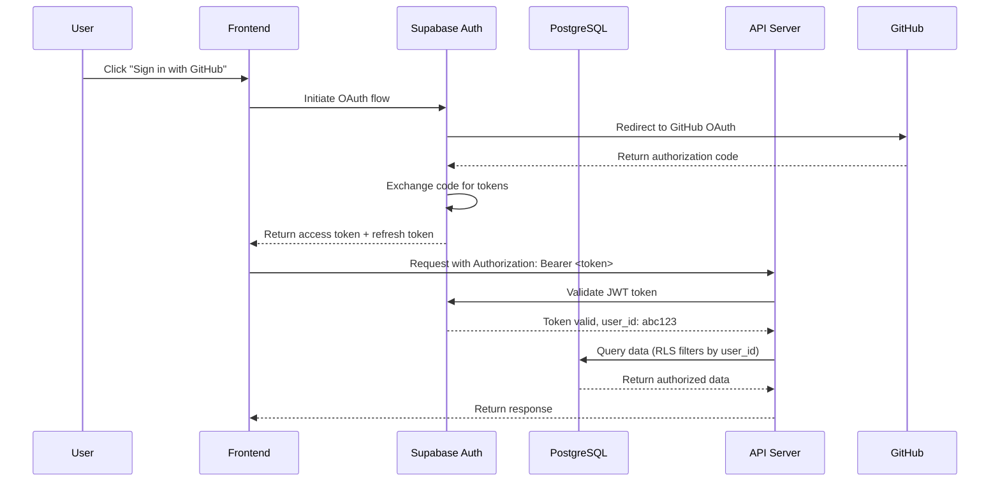

# Authentication & Authorization

**Task**: Day 6 - Authentication & Authorization Architecture  
**Created**: November 30, 2025  
**Status**: Final

---

## Executive Summary

This document defines the **authentication and authorization architecture** for OpenHR Platform, ensuring secure user identity management, session handling, and role-based access control. The system uses **Supabase Auth** for authentication (OAuth 2.0, JWT), **Row-Level Security (RLS)** for authorization, and **API key management** for ML service integrations.

Security is critical for a co-founder matching platform where users share sensitive career data and engage in high-stakes conversations about equity and partnerships.

---

## Authentication vs. Authorization

### Authentication (AuthN)
**"Who are you?"**
- Verifies user identity
- Handled by Supabase Auth
- Methods: Email/password, OAuth (GitHub, Google, LinkedIn)

### Authorization (AuthZ)
**"What can you do?"**
- Determines user permissions
- Handled by Supabase Row-Level Security (RLS)
- Methods: Role-based access control (RBAC), policy-based

---

## Authentication Architecture

### System Overview



---

## Authentication Methods

### 1. Email & Password

**Flow**:
1. User enters email + password
2. Supabase Auth validates credentials
3. Returns access token (JWT) + refresh token
4. Frontend stores tokens in `localStorage` or `httpOnly` cookie

**Password Requirements**:
- Minimum 8 characters
- At least 1 uppercase letter
- At least 1 number
- No common passwords (e.g., "password123")

**Implementation**:
```typescript
// Sign up
const { data, error } = await supabase.auth.signUp({
  email: 'user@example.com',
  password: 'SecurePass123!',
});

// Sign in
const { data, error } = await supabase.auth.signInWithPassword({
  email: 'user@example.com',
  password: 'SecurePass123!',
});
```

**Security**:
- Passwords hashed with bcrypt (Supabase default)
- No plain-text passwords stored
- Rate limiting: 5 failed attempts = 15-minute lockout

---

### 2. GitHub OAuth 2.0

**Flow**:
1. User clicks "Sign in with GitHub"
2. Frontend redirects to GitHub OAuth consent page
3. User authorizes OpenHR
4. GitHub returns authorization code to callback URL
5. Supabase exchanges code for access token
6. Supabase creates/updates user record
7. Frontend receives JWT token

**Scopes Requested**:
- `user:email` (email address)
- `read:user` (public profile)
- `public_repo` (public repositories, optional for profile enrichment)

**Implementation**:
```typescript
const { data, error } = await supabase.auth.signInWithOAuth({
  provider: 'github',
  options: {
    redirectTo: 'https://openhr.com/auth/callback',
    scopes: 'user:email read:user',
  },
});
```

**Supabase Configuration**:
- Enable GitHub provider in Supabase dashboard
- Add GitHub OAuth App client ID and secret
- Set callback URL: `https://<project-ref>.supabase.co/auth/v1/callback`

---

### 3. Google OAuth 2.0

**Flow**: Similar to GitHub OAuth

**Scopes Requested**:
- `openid` (OpenID Connect)
- `email` (email address)
- `profile` (name, avatar)

**Implementation**:
```typescript
const { data, error } = await supabase.auth.signInWithOAuth({
  provider: 'google',
  options: {
    redirectTo: 'https://openhr.com/auth/callback',
  },
});
```

**Use Case**: Preferred for business co-founders (less technical than GitHub)

---

### 4. LinkedIn OAuth (Future)

**Note**: LinkedIn OAuth has strict API limits and review process

**Alternative**: Manual LinkedIn profile URL submission + verification

---

## Session Management

### JWT Access Tokens

**Structure**:
```json
{
  "sub": "user-uuid-123",
  "email": "user@example.com",
  "role": "authenticated",
  "iat": 1700000000,
  "exp": 1700003600
}
```

**Properties**:
- **Expiration**: 1 hour (3600 seconds)
- **Signing Algorithm**: HS256 (HMAC with SHA-256)
- **Storage**: `localStorage` or `httpOnly` cookie

**Security Considerations**:
- Short expiration reduces risk of token theft
- Refresh tokens used to get new access tokens
- Tokens include `exp` (expiration) and `iat` (issued at)

---

### Refresh Tokens

**Purpose**: Long-lived tokens to obtain new access tokens without re-login

**Properties**:
- **Expiration**: 30 days (2,592,000 seconds)
- **Storage**: `httpOnly` cookie (more secure than `localStorage`)
- **Rotation**: New refresh token issued on each refresh

**Refresh Flow**:
1. Access token expires after 1 hour
2. Frontend detects 401 Unauthorized response
3. Frontend sends refresh token to `/auth/v1/token?grant_type=refresh_token`
4. Supabase validates refresh token
5. Supabase returns new access token + new refresh token
6. Old refresh token invalidated

**Implementation**:
```typescript
const { data, error } = await supabase.auth.refreshSession();
// Automatically handles refresh token rotation
```

---

### Session Storage

**Recommended**: `httpOnly` cookies (XSS protection)

**Alternative**: `localStorage` (easier for SPAs, but vulnerable to XSS)

**Supabase Client Configuration**:
```typescript
const supabase = createClient(SUPABASE_URL, SUPABASE_ANON_KEY, {
  auth: {
    storage: window.localStorage, // or custom storage adapter
    autoRefreshToken: true,
    persistSession: true,
    detectSessionInUrl: true,
  },
});
```

---

## Authorization (Access Control)

### Row-Level Security (RLS)

**Principle**: Users can only access data they own or are authorized to see

**Supabase RLS**: PostgreSQL policies filter rows based on `auth.uid()` (authenticated user ID)

---

### RLS Policies by Table

#### 1. Users Table

**Policy**: Users can only read their own user record

```sql
CREATE POLICY "Users can view own record"
ON users
FOR SELECT
USING (auth.uid() = id);

CREATE POLICY "Users can update own record"
ON users
FOR UPDATE
USING (auth.uid() = id);
```

---

#### 2. Profiles Table

**Policy**: Users can read their own profile + profiles of matches

```sql
CREATE POLICY "Users can view own profile"
ON profiles
FOR SELECT
USING (auth.uid() = user_id);

CREATE POLICY "Users can view matched profiles"
ON profiles
FOR SELECT
USING (
  user_id IN (
    SELECT matched_user_id FROM matches WHERE user_id = auth.uid()
    UNION
    SELECT user_id FROM matches WHERE matched_user_id = auth.uid()
  )
);

CREATE POLICY "Users can update own profile"
ON profiles
FOR UPDATE
USING (auth.uid() = user_id);
```

---

#### 3. Messages Table

**Policy**: Users can only see messages in their conversations

```sql
CREATE POLICY "Users can view own messages"
ON messages
FOR SELECT
USING (
  auth.uid() IN (
    SELECT user1_id FROM conversations WHERE id = conversation_id
    UNION
    SELECT user2_id FROM conversations WHERE id = conversation_id
  )
);

CREATE POLICY "Users can send messages in own conversations"
ON messages
FOR INSERT
WITH CHECK (
  auth.uid() = sender_id
  AND sender_id IN (
    SELECT user1_id FROM conversations WHERE id = conversation_id
    UNION
    SELECT user2_id FROM conversations WHERE id = conversation_id
  )
);
```

---

#### 4. Matches Table

**Policy**: Users can view their own matches

```sql
CREATE POLICY "Users can view own matches"
ON matches
FOR SELECT
USING (auth.uid() = user_id OR auth.uid() = matched_user_id);

CREATE POLICY "System can create matches"
ON matches
FOR INSERT
WITH CHECK (TRUE); -- Only backend service can insert
```

**Note**: Match creation is restricted to backend service (not user-facing)

---

### Service Role Key (Backend)

**Purpose**: Bypass RLS for backend operations (e.g., match computation, admin tasks)

**Usage**: Backend services use `SUPABASE_SERVICE_ROLE_KEY` (secret, never exposed to frontend)

**Example**:
```python
import os
from supabase import create_client

supabase = create_client(
    os.getenv('SUPABASE_URL'),
    os.getenv('SUPABASE_SERVICE_ROLE_KEY')  # Bypasses RLS
)

# Admin operation: compute matches for all users
matches = supabase.table('matches').insert([...]).execute()
```

**Security**: Service role key must be stored in environment variables, never committed to Git

---

## Role-Based Access Control (RBAC)

### User Roles

| Role | Description | Permissions |
|------|-------------|-------------|
| `user` | Default role for all users | Read own data, update own profile, message matches |
| `admin` | Platform administrators | Read all data, update any data, delete users, view analytics |
| `moderator` | Content moderators | Review flagged profiles, suspend spam accounts |
| `system` | Backend services | Bypass RLS, compute matches, send notifications |

### Role Assignment

**Database Schema**:
```sql
CREATE TABLE user_roles (
  id UUID PRIMARY KEY DEFAULT uuid_generate_v4(),
  user_id UUID REFERENCES users(id),
  role VARCHAR(50) NOT NULL, -- 'user', 'admin', 'moderator'
  granted_by UUID REFERENCES users(id),
  granted_at TIMESTAMP DEFAULT NOW()
);
```

**RLS Policy** (Admin-only read access):
```sql
CREATE POLICY "Admins can view all profiles"
ON profiles
FOR SELECT
USING (
  EXISTS (
    SELECT 1 FROM user_roles
    WHERE user_id = auth.uid() AND role = 'admin'
  )
);
```

---

## API Key Management (ML Services)

### Backend-to-Backend Authentication

**Use Case**: Python ML service (FastAPI) needs to access Supabase

**Method**: Service role key in environment variables

**Environment Variables**:
```bash
SUPABASE_URL=https://<project-ref>.supabase.co
SUPABASE_SERVICE_ROLE_KEY=eyJhbGciOiJIUzI1NiIsInR5cCI6IkpXVCJ9...
OPENAI_API_KEY=sk-...
GITHUB_CLIENT_ID=...
GITHUB_CLIENT_SECRET=...
```

**Security Best Practices**:
- Use `.env` files (never commit to Git)
- Rotate keys quarterly
- Use secret management (AWS Secrets Manager, Vercel Env Vars)

---

### External API Authentication (GitHub, LinkedIn)

**GitHub**:
- User-specific access tokens (OAuth)
- Stored in `github_verifications` table, encrypted
- Refresh tokens used for long-term access

**LinkedIn**:
- OAuth access tokens (short-lived, 60 days)
- Stored encrypted, refreshed as needed

---

## Security Best Practices

### 1. HTTPS Everywhere

- All API requests over HTTPS (TLS 1.3)
- HTTP requests redirected to HTTPS
- HSTS (HTTP Strict Transport Security) enabled

**Next.js Configuration**:
```javascript
// next.config.js
module.exports = {
  async headers() {
    return [
      {
        source: '/(.*)',
        headers: [
          {
            key: 'Strict-Transport-Security',
            value: 'max-age=31536000; includeSubDomains; preload',
          },
        ],
      },
    ];
  },
};
```

---

### 2. CSRF Protection

**Method**: CSRF tokens for state-changing requests (POST, PUT, DELETE)

**Supabase**: Automatically handles CSRF via SameSite cookies

**Custom Implementation** (if needed):
```typescript
// Generate CSRF token on page load
const csrfToken = generateRandomToken();
sessionStorage.setItem('csrf_token', csrfToken);

// Include in requests
fetch('/api/profile', {
  method: 'POST',
  headers: {
    'X-CSRF-Token': csrfToken,
  },
  body: JSON.stringify({ name: 'John Doe' }),
});
```

---

### 3. Rate Limiting

**Purpose**: Prevent brute-force attacks, API abuse

**Limits**:
- **Login**: 5 attempts per 15 minutes per IP
- **API Requests**: 100 requests per minute per user
- **Message Sending**: 20 messages per hour per user

**Implementation** (Vercel Edge Functions):
```typescript
import { Ratelimit } from '@upstash/ratelimit';
import { Redis } from '@upstash/redis';

const ratelimit = new Ratelimit({
  redis: Redis.fromEnv(),
  limiter: Ratelimit.slidingWindow(100, '1 m'),
});

export default async function handler(req: Request) {
  const identifier = req.headers.get('x-forwarded-for') || 'anonymous';
  const { success } = await ratelimit.limit(identifier);

  if (!success) {
    return new Response('Rate limit exceeded', { status: 429 });
  }

  // Process request...
}
```

---

### 4. Input Validation

**Validate all user inputs** to prevent SQL injection, XSS, and other attacks

**Example** (Zod validation):
```typescript
import { z } from 'zod';

const profileSchema = z.object({
  name: z.string().min(2).max(100),
  bio: z.string().min(50).max(500),
  location: z.string().max(100),
  skills: z.array(z.string()).min(3).max(50),
});

// Validate before saving
const result = profileSchema.safeParse(req.body);
if (!result.success) {
  return res.status(400).json({ error: result.error });
}
```

---

### 5. Content Security Policy (CSP)

**Purpose**: Prevent XSS attacks by restricting resource loading

**Implementation**:
```javascript
// next.config.js
module.exports = {
  async headers() {
    return [
      {
        source: '/(.*)',
        headers: [
          {
            key: 'Content-Security-Policy',
            value: [
              "default-src 'self'",
              "script-src 'self' 'unsafe-inline' 'unsafe-eval'",
              "style-src 'self' 'unsafe-inline'",
              "img-src 'self' data: https:",
              "font-src 'self' data:",
              "connect-src 'self' https://*.supabase.co",
            ].join('; '),
          },
        ],
      },
    ];
  },
};
```

---

## Testing & Monitoring

### Security Testing

**Automated**:
- **OWASP ZAP**: Vulnerability scanning
- **Snyk**: Dependency vulnerability scanning
- **GitHub Dependabot**: Automated security updates

**Manual**:
- **Penetration Testing**: Annually by third-party security firm
- **Code Reviews**: Security-focused reviews for auth changes

### Monitoring

**Metrics**:
- Failed login attempts per IP
- API rate limit violations
- Suspicious activity (e.g., 100 profile views in 1 hour)
- Token refresh failures

**Alerts**:
- **Sentry**: Error tracking and alerting
- **Supabase Logs**: Database and auth logs
- **PostHog**: User behavior anomaly detection

---
## Implementation Roadmap

### Phase 1: Basic Auth (Weeks 1-2)

- [ ] Set up Supabase Auth
- [ ] Implement email/password signup/login
- [ ] Implement GitHub OAuth
- [ ] Implement Google OAuth
- [ ] JWT token management (access + refresh)

### Phase 2: RLS Policies (Weeks 3-4)

- [ ] Define RLS policies for all tables
- [ ] Test policies with multiple users
- [ ] Implement service role key for backend

### Phase 3: Security Hardening (Weeks 5-6)

- [ ] HTTPS enforcement
- [ ] CSRF protection
- [ ] Rate limiting
- [ ] Input validation (Zod)
- [ ] CSP headers

### Phase 4: Monitoring (Weeks 7-8)

- [ ] Set up Sentry for error tracking
- [ ] Configure Supabase logs and alerts
- [ ] Implement security dashboard
- [ ] Penetration testing

---

## References

1. **Supabase Auth**: https://supabase.com/docs/guides/auth
2. **OAuth 2.0 Specification**: https://oauth.net/2/
3. **JWT Best Practices**: https://tools.ietf.org/html/rfc8725
4. **OWASP Top 10**: https://owasp.org/www-project-top-ten/
5. **Supabase RLS**: https://supabase.com/docs/guides/auth/row-level-security

---

**Document Owner**: OpenHR Research & Planning Agent  
**Last Updated**: November 30, 2025  
**Version**: 1.0  
**Status**: Final
