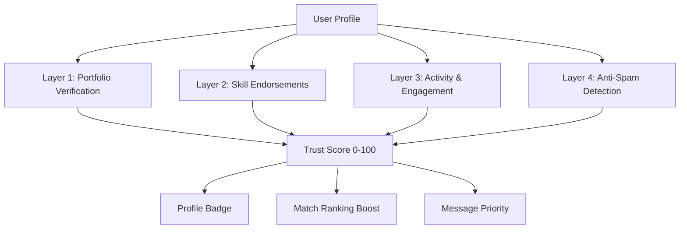

# Trust & Verification System

**Task**: Day 6 - Trust & Verification System Design  
**Created**: November 30, 2025  
**Status**: Final

---

## Executive Summary

This document defines the **Trust & Verification System** for OpenHR Platform—a multi-layered approach to building trust between co-founders and developers through portfolio verification, skill endorsements, activity tracking, and anti-spam detection. The system ensures that profiles are legitimate, skills are validated, and users can confidently engage with verified matches.

The trust system is essential for OpenHR's credibility as a co-founder matching platform, where high-stakes decisions (equity splits, co-founder partnerships) require verified information.

---

## Problem Statement

Current co-founder and developer matching platforms suffer from:

1. **Fake Profiles**: Spam accounts, recruiters posing as founders, and fabricated portfolios
2. **Unverified Skills**: Users can claim any skill without validation
3. **No Reputation System**: No way to assess trustworthiness or past success
4. **Spam Messages**: Users bombarded by irrelevant or low-quality messages
5. **Low Commitment Signals**: Difficult to distinguish serious founders from casual browsers

**Result**: Users waste time on unqualified or fake matches, leading to low trust and poor platform reputation.

---

## Trust System Goals

### Primary Objectives

1. **Verify Portfolio Authenticity**: Ensure GitHub repos, websites, and LinkedIn profiles are legitimate
2. **Validate Skills**: Confirm claimed skills through endorsements and portfolio analysis
3. **Build Reputation Scores**: Track user activity, engagement, and success metrics
4. **Prevent Spam**: Detect and block fake profiles, low-quality messages, and recruiter spam
5. **Signal Commitment**: Help users identify serious founders vs. casual browsers

### Success Metrics

- **Verification Rate**: 80%+ of active users have at least one verified item (GitHub, LinkedIn, or website)
- **Endorsement Rate**: 40%+ of users have at least 3 skill endorsements
- **Spam Detection**: <5% spam accounts, <2% false positives
- **Trust Score Coverage**: 90%+ of users have a trust score (0-100)
- **User Confidence**: 70%+ users "trust" matches are legitimate (user survey)

---

## Trust System Architecture

### 4-Layer Trust Model



### Trust Score Calculation

**Trust Score = (Verification × 40%) + (Endorsements × 25%) + (Activity × 20%) + (Anti-Spam × 15%)**

**Components**:
1. **Portfolio Verification (40%)**: GitHub, LinkedIn, website ownership
2. **Skill Endorsements (25%)**: Endorsements from connections
3. **Activity & Engagement (20%)**: Profile completeness, message quality, response rate
4. **Anti-Spam Score (15%)**: No spam flags, no suspicious behavior

**Trust Score Ranges**:
- **0-39**: Low Trust (red flag, limited visibility)
- **40-69**: Medium Trust (standard user)
- **70-89**: High Trust (verified badge)
- **90-100**: Excellent Trust (verified badge + boost in rankings)

---

## Layer 1: Portfolio Verification

### 1.1 GitHub Verification

**Goal**: Verify user owns claimed GitHub account and has active contributions

#### Verification Process

1. **OAuth Connection**: User connects GitHub via OAuth 2.0
2. **Ownership Check**: Verify access token matches claimed username
3. **Activity Analysis**:
   - Total public repos (min 3 for verification)
   - Total commits in last 12 months (min 20 for active status)
   - Contribution graph consistency (no sudden spikes)
   - Starred repos relevance (align with claimed skills)
4. **Verification Badge**: "GitHub Verified" badge on profile

#### Verification Criteria

| Criteria | Requirement | Points |
|----------|-------------|--------|
| OAuth Connected | Required | 20 |
| Public Repos | ≥ 3 repos | 20 |
| Recent Activity | ≥ 20 commits/year | 30 |
| Contribution Consistency | No suspicious spikes | 20 |
| Skill Alignment | Starred repos match skills | 10 |

**Total Possible**: 100 points → GitHub Verification Score

#### Implementation

**API Endpoints**:
- `POST /verification/github/initiate` - Start GitHub OAuth flow
- `GET /verification/github/status/:user_id` - Check verification status
- `POST /verification/github/reverify/:user_id` - Re-verify (monthly)

**Database Tables**:
```sql
CREATE TABLE github_verifications (
  id UUID PRIMARY KEY,
  user_id UUID REFERENCES users(id),
  github_username VARCHAR(255),
  verified_at TIMESTAMP,
  score INTEGER, -- 0-100
  public_repos INTEGER,
  total_commits INTEGER,
  last_commit_at TIMESTAMP,
  verification_expires_at TIMESTAMP, -- Re-verify monthly
  created_at TIMESTAMP DEFAULT NOW()
);
```

**Background Job**: Monthly cron job re-verifies all GitHub connections

---

### 1.2 LinkedIn Verification

**Goal**: Verify professional identity and work history

#### Verification Process

1. **Manual Link Submission**: User provides LinkedIn profile URL
2. **Scraping (User-Authorized)**:
   - Name and headline match profile
   - Work experience consistency (no gaps > 2 years)
   - Minimum 50 connections (active professional)
3. **Optional OAuth**: LinkedIn Sign In with OpenID Connect
4. **Verification Badge**: "LinkedIn Verified" badge on profile

#### Verification Criteria

| Criteria | Requirement | Points |
|----------|-------------|--------|
| Profile URL Provided | Required | 20 |
| Name Match | Name matches OpenHR profile | 30 |
| Work History | ≥ 2 years experience listed | 30 |
| Connections | ≥ 50 connections | 20 |

**Total Possible**: 100 points → LinkedIn Verification Score

**Note**: Due to LinkedIn API restrictions, full automation is limited. Manual review may be required for high-trust profiles.

---

### 1.3 Website / Portfolio Verification

**Goal**: Verify ownership of personal website or portfolio

#### Verification Process

1. **User Provides URL**: User claims website ownership
2. **Verification Methods** (user chooses one):
   - **DNS TXT Record**: Add `openhr-verify=<token>` to DNS
   - **HTML Meta Tag**: Add `<meta name="openhr-verify" content="<token>">` to homepage
   - **File Upload**: Upload `openhr-verify-<token>.txt` to website root
3. **Verification Check**: System verifies token within 24 hours
4. **Verification Badge**: "Website Verified" badge on profile

#### Implementation

**API Endpoints**:
- `POST /verification/website/initiate` - Request verification token
- `POST /verification/website/check/:user_id` - Verify ownership

**Verification Job**: Check for verification token via HTTP request

```python
import requests
from bs4 import BeautifulSoup

def verify_website(url: str, token: str) -> bool:
    try:
        # Check HTML meta tag
        response = requests.get(url, timeout=10)
        soup = BeautifulSoup(response.content, 'html.parser')
        meta_tag = soup.find('meta', {'name': 'openhr-verify'})
        if meta_tag and meta_tag.get('content') == token:
            return True
        
        # Check verification file
        file_url = f"{url}/openhr-verify-{token}.txt"
        file_response = requests.get(file_url, timeout=10)
        if file_response.status_code == 200 and token in file_response.text:
            return True
        
        # DNS check would be done separately using dnspython
        
        return False
    except Exception as e:
        return False
```

---

## Layer 2: Skill Endorsements

### 2.1 Endorsement System

**Goal**: Validate claimed skills through endorsements from connections

#### How Endorsements Work

1. **Request Endorsement**: User can request endorsement from:
   - Past co-workers (via email invite)
   - Collaborators from GitHub (detected automatically)
   - Other OpenHR users (if matched and messaged)
2. **Endorser Validation**: Endorser must have:
   - Verified email or GitHub account
   - Profile on OpenHR (optional, but encouraged)
3. **Endorsement Scope**: Endorser specifies:
   - Skill(s) being endorsed (e.g., React, Product Management)
   - Relationship (Co-worker, Collaborator, Manager, Client)
   - Optional: Brief testimonial (100 chars)
4. **Display**: Endorsements shown on profile with endorser name and relationship

#### Endorsement Weight

**Not all endorsements are equal**:

| Endorser Type | Weight | Rationale |
|---------------|--------|----------|
| OpenHR Verified User | 1.0x | Trustworthy, verified identity |
| Email-Verified External | 0.7x | Identity confirmed, not on platform |
| GitHub Collaborator | 0.8x | Detected via commits, semi-automated |
| Anonymous / Unverified | 0.3x | Low trust, potential self-endorsement |

**Endorsement Score per Skill**:
```
Skill Score = Σ(Endorsement Weight) / Total Endorsements
```

**Example**: React skill with 5 endorsements:
- 3 OpenHR verified users: 3 × 1.0 = 3.0
- 2 email-verified external: 2 × 0.7 = 1.4
- **Total Score**: 4.4 / 5 = 0.88 (88% confidence)

#### Implementation

**API Endpoints**:
- `POST /endorsements/request` - Request endorsement from email
- `POST /endorsements/create` - Create new endorsement
- `GET /endorsements/:user_id/:skill_id` - Get endorsements for skill

**Database Tables**:
```sql
CREATE TABLE endorsements (
  id UUID PRIMARY KEY,
  user_id UUID REFERENCES users(id), -- Person being endorsed
  endorser_id UUID REFERENCES users(id), -- Person giving endorsement (NULL if external)
  endorser_email VARCHAR(255), -- External endorser email
  skill_id UUID REFERENCES skills(id),
  relationship VARCHAR(50), -- 'coworker', 'manager', 'client', 'collaborator'
  testimonial TEXT,
  weight DECIMAL(3,2), -- 0.3 to 1.0
  verified BOOLEAN DEFAULT FALSE,
  created_at TIMESTAMP DEFAULT NOW()
);
```

**Anti-Abuse**: Limit 10 endorsements per user per day to prevent spam

---

### 2.2 GitHub Collaborator Endorsements

**Goal**: Automatically detect and suggest endorsements from GitHub collaborators

#### Process

1. **Detect Collaborators**: Analyze user's GitHub repos for co-contributors
2. **Find on OpenHR**: Check if collaborators are registered on OpenHR
3. **Suggest Endorsement**: Show prompt: "You collaborated with @johndoe on repo XYZ. Endorse their React skills?"
4. **One-Click Endorsement**: User can endorse with one click
5. **Bi-Directional**: Suggest reciprocal endorsements

**Detection Query** (GitHub API):
```python
repos = github_client.get_user_repos(username)
for repo in repos:
    contributors = github_client.get_repo_contributors(repo.full_name)
    for contributor in contributors:
        if contributor.login != username:
            # Check if contributor is on OpenHR
            openhr_user = find_user_by_github(contributor.login)
            if openhr_user:
                suggest_endorsement(user_id, openhr_user.id, repo.name)
```

---

## Layer 3: Activity & Engagement Tracking

### 3.1 Activity Metrics

**Goal**: Track user engagement to identify active, committed users

#### Tracked Metrics

| Metric | Description | Weight |
|--------|-------------|--------|
| Profile Completeness | % of profile fields filled | 25% |
| Message Response Rate | % of messages replied to within 48h | 20% |
| Message Quality | Avg message length, no spam flags | 15% |
| Login Frequency | Days active per week | 15% |
| Match Engagement | % of matches viewed/messaged | 10% |
| Profile Updates | Last profile update recency | 10% |
| Community Contribution | GitHub stars, blog posts, referrals | 5% |

**Activity Score Calculation**:
```
Activity Score = Σ(Metric × Weight)
```

#### Profile Completeness Score

**Required Fields** (20 points each):
- ✓ Avatar uploaded
- ✓ Bio written (min 50 chars)
- ✓ Skills added (min 3 skills)
- ✓ Startup preferences set
- ✓ Vision/looking-for statement (min 50 chars)

**Total**: 100 points = 100% complete

#### Message Response Rate

**Calculation**:
```
Response Rate = (Messages Replied Within 48h) / (Total Messages Received)
```

**Thresholds**:
- 80-100%: Excellent (highly responsive)
- 60-79%: Good
- 40-59%: Average
- <40%: Low (may reduce match visibility)

---

### 3.2 Success Tracking

**Goal**: Track successful outcomes (co-founder partnerships formed, funding raised, products launched)

#### Self-Reported Success Events

**Users can report**:
- "Found My Co-Founder" (link to match)
- "Joined a Startup" (startup name, role)
- "Raised Funding" (amount, stage)
- "Launched Product" (product URL)
- "Exited Startup" (acquisition, IPO)

**Verification**: Optional verification via:
- LinkedIn update
- Crunchbase listing
- Product Hunt launch
- News article link

**Reputation Boost**: Verified success events increase trust score by 5-15 points

#### Implementation

**API Endpoints**:
- `POST /success-events/create` - Report success event
- `GET /success-events/:user_id` - Get user's success history

**Database Tables**:
```sql
CREATE TABLE success_events (
  id UUID PRIMARY KEY,
  user_id UUID REFERENCES users(id),
  event_type VARCHAR(50), -- 'cofounder_found', 'funding_raised', 'product_launched'
  description TEXT,
  verification_url VARCHAR(500),
  verified BOOLEAN DEFAULT FALSE,
  reputation_boost INTEGER DEFAULT 0,
  created_at TIMESTAMP DEFAULT NOW()
);
```

---

## Layer 4: Anti-Spam Detection

### 4.1 Fake Profile Detection

**Goal**: Identify and flag fake or suspicious profiles

#### Red Flags (Automated)

| Red Flag | Description | Severity |
|----------|-------------|----------|
| No Avatar | Default avatar after 7 days | Low |
| Incomplete Profile | <30% profile completeness | Medium |
| No Verifications | No GitHub/LinkedIn/website verified | Medium |
| Generic Bio | Bio matches common spam patterns | High |
| Rapid Account Creation | Multiple accounts from same IP in 24h | High |
| No Activity | Zero messages sent in 30 days | Low |
| Suspicious Skills | 50+ skills claimed | High |

**Spam Score Calculation**:
```
Spam Score = Σ(Red Flag Severity × Weight)
```

**Thresholds**:
- 0-20: Clean (no action)
- 21-40: Low Risk (monitor)
- 41-60: Medium Risk (reduce visibility)
- 61-80: High Risk (flag for manual review)
- 81-100: Spam (auto-suspend, require verification)

#### Implementation

**Spam Detection Job**: Daily cron job scores all users

```python
def calculate_spam_score(user: User) -> int:
    score = 0
    
    if not user.avatar_url:
        score += 10
    if user.profile_completeness < 30:
        score += 20
    if not user.github_verified and not user.linkedin_verified:
        score += 20
    if is_generic_bio(user.bio):
        score += 30
    if user.skills_count > 50:
        score += 40
    if user.messages_sent_30d == 0:
        score += 5
    
    return min(score, 100)
```

---

### 4.2 Spam Message Detection

**Goal**: Detect and filter spam or low-quality messages

#### Message Quality Signals

**Good Message Indicators**:
- Personalized (mentions match's skills, bio, or projects)
- Reasonable length (50-500 characters)
- Asks questions or proposes next steps
- No external links (or only LinkedIn/GitHub)

**Spam Message Indicators**:
- Generic template ("Hi, check out my startup")
- Too short (<10 characters) or too long (>1000 characters)
- Multiple external links
- All caps or excessive punctuation
- Copy-pasted message (sent to 10+ users verbatim)

**Spam Detection Model**: Use LLM (GPT-4 or Claude) to classify messages

**Prompt**:
```
Classify this message as GOOD, SPAM, or UNCERTAIN:

Message: "{message_content}"

Good indicators: personalized, mentions match's profile, asks questions
Spam indicators: generic template, external links, all caps, copy-pasted

Output: GOOD | SPAM | UNCERTAIN
```

**Action on Spam**:
- SPAM: Message flagged, sender warned (3 warnings = account review)
- UNCERTAIN: Allow message, but don't send push notification

---

### 4.3 Recruiter & Third-Party Detection

**Goal**: Identify recruiters posing as founders or developers

#### Detection Signals

**Recruiter Indicators**:
- Bio mentions "hiring", "recruiting", "agency"
- LinkedIn profile shows recruiter role
- Messages multiple users with job offers
- No technical skills claimed
- Domain email (e.g., @recruiter-agency.com)

**Action**:
- Flag profile as "Recruiter" (shown on profile)
- Limit to 5 messages per week
- No match boost, reduced visibility
- Optional: Create separate "Recruiters" section (future feature)

**Manual Review**: Flagged users can appeal via support ticket

---

## Trust System UI/UX

### Profile Trust Badge

**Display on Profile**:
```
+---------------------------+
| [Avatar]  John Doe        |
|           Full-Stack Dev  |
|                           |
|  Trust Score: 85 / 100    |
|  [✓ Verified Badge]       |
|                           |
|  ✓ GitHub Verified        |
|  ✓ LinkedIn Verified      |
|  ✓ 5 Skill Endorsements   |
|  ✓ Active (logged in 2d ago) |
+---------------------------+
```

### Verification Status Page

**User sees their own verification status**:
```
Your Trust Score: 72 / 100 (High Trust)

What's Included:
✓ GitHub Verified (40 points)
✓ 3 Skill Endorsements (20 points)
✓ Profile 90% Complete (12 points)
✗ LinkedIn Not Verified (0 points)
✗ Website Not Verified (0 points)

Boost Your Trust Score:
[ Connect LinkedIn ] (+30 points)
[ Verify Website ] (+20 points)
[ Request More Endorsements ] (+5 points each)
```

---

## Privacy & User Control

### User Controls

1. **Opt-Out of Public Trust Score**: User can hide trust score from public profile (but it still affects match ranking)
2. **Endorsement Privacy**: User can approve/reject endorsements before they appear
3. **Activity Tracking Opt-Out**: User can disable activity tracking (but reduces trust score)
4. **Data Export**: User can export all verification and endorsement data (GDPR)

### Data Retention

- **Verification Data**: Stored indefinitely (until user deletes account)
- **Activity Logs**: Aggregated monthly, detailed logs deleted after 90 days
- **Spam Flags**: Cleared after 6 months if no further violations

---

## Implementation Roadmap

### Phase 1: Basic Verification (Weeks 1-4)

- [ ] GitHub OAuth verification
- [ ] LinkedIn URL verification (manual)
- [ ] Profile completeness tracking
- [ ] Trust score calculation (basic)
- [ ] Verification badges on profiles

### Phase 2: Endorsements & Activity (Weeks 5-8)

- [ ] Skill endorsement system
- [ ] GitHub collaborator detection
- [ ] Activity metrics tracking (response rate, login frequency)
- [ ] Message quality scoring

### Phase 3: Anti-Spam & Reputation (Weeks 9-12)

- [ ] Spam profile detection
- [ ] Spam message detection (LLM-based)
- [ ] Recruiter detection and flagging
- [ ] Success event tracking
- [ ] Reputation boost system

---

## Success Metrics (KPIs)

### Trust System Performance

- **Verification Rate**: 80%+ users verified (GitHub or LinkedIn)
- **Endorsement Coverage**: 40%+ users have ≥3 endorsements
- **Spam Detection Accuracy**: 95%+ true positive rate, <5% false positives
- **Trust Score Distribution**: Bell curve with mean ~60-70
- **User Confidence**: 70%+ users trust matches are legitimate (survey)

### Business Impact

- **Conversation Rate**: +15% increase (high-trust users more likely to message)
- **Match Quality**: +20% user satisfaction with match relevance
- **Retention**: +10% 30-day retention (users trust platform more)
- **Spam Reports**: <1% of messages flagged as spam

---

## References

1. **LinkedIn Verification**: https://www.linkedin.com/help/linkedin/answer/a548902
2. **GitHub OAuth**: https://docs.github.com/en/apps/oauth-apps/building-oauth-apps/authorizing-oauth-apps
3. **Anti-Spam Best Practices**: GDPR Article 5 (Data Minimization)
4. **Endorsement Systems**: LinkedIn Endorsements, Upwork Skill Tests

---

**Document Owner**: OpenHR Research & Planning Agent  
**Last Updated**: November 30, 2025  
**Version**: 1.0  
**Status**: Final
